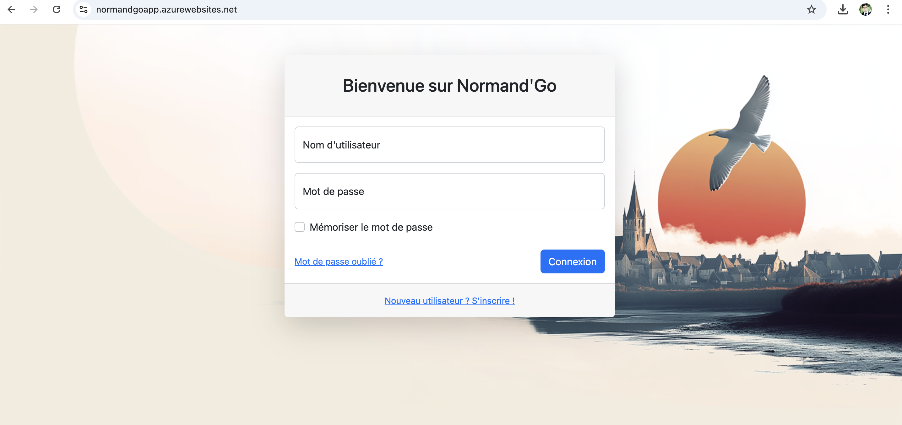
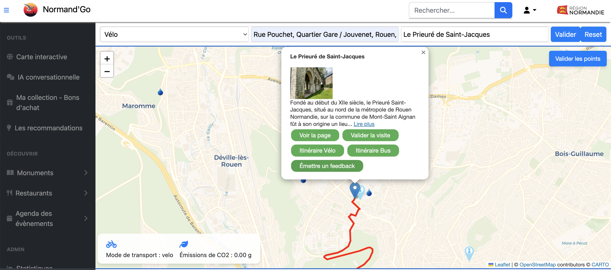
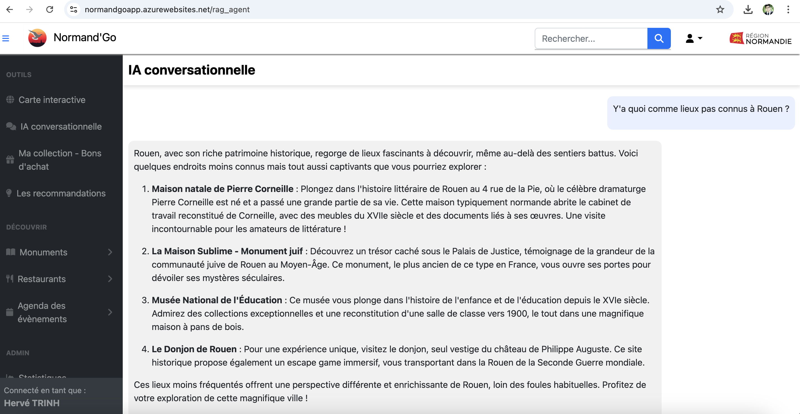
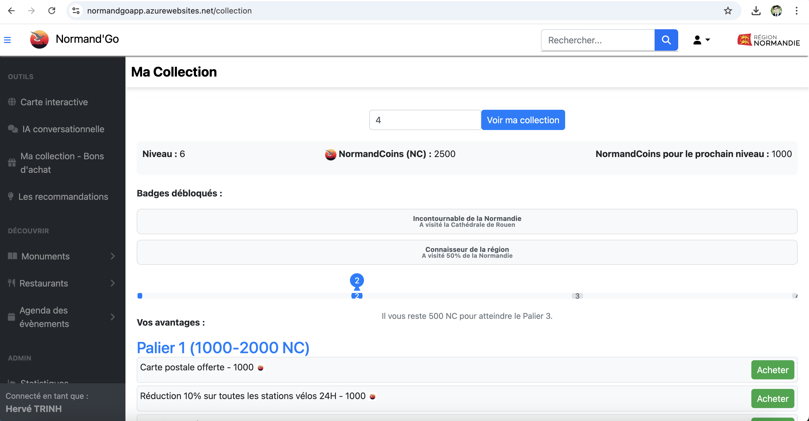
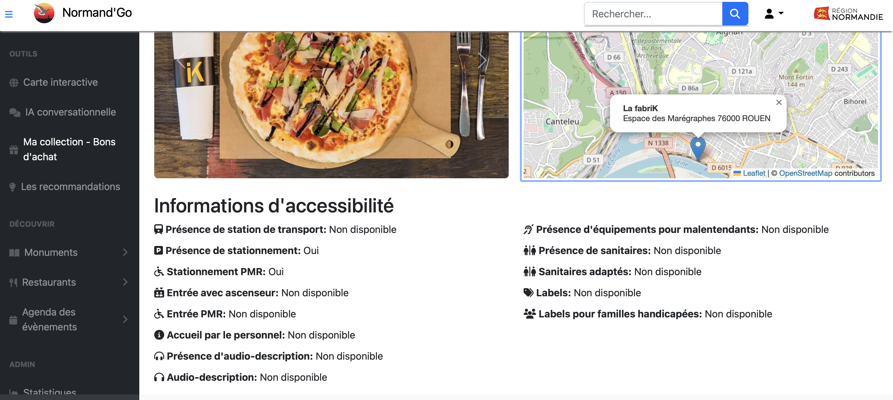
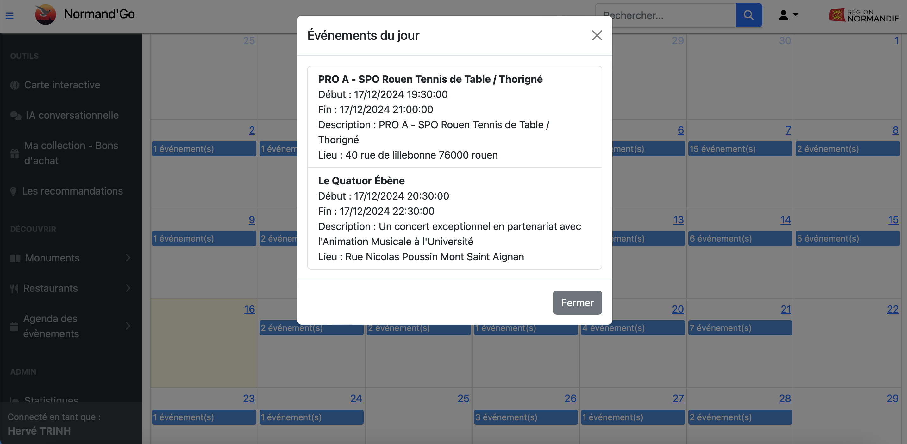
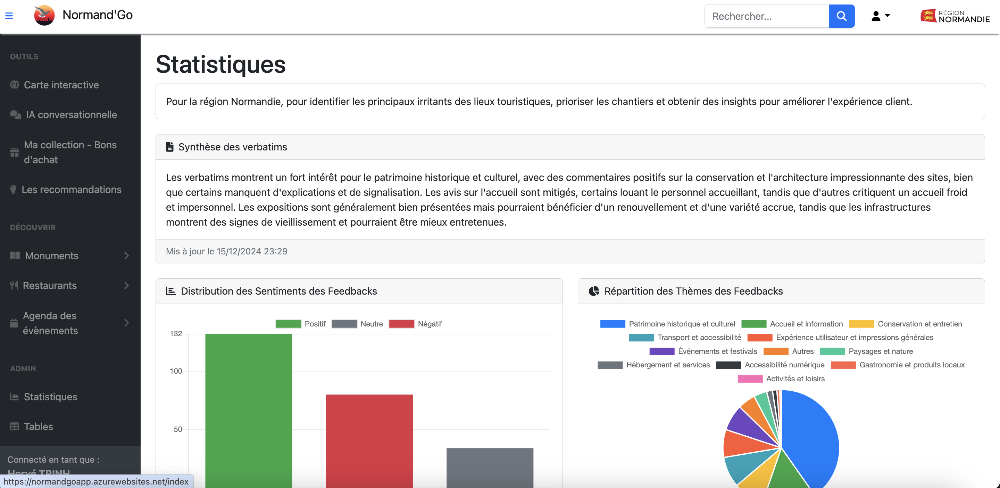
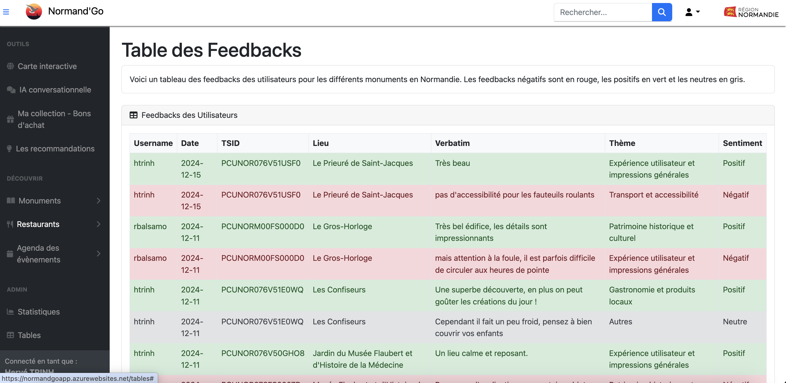

# Normand'Go

## Overview

Normand'Go is a web application (MVP) developed in just six days for the Normandie Region by Rémi Balsamo and myself, Hervé Trinh. Built with the Flask framework, the platform allows users to discover tourist attractions, restaurants, and events, while also providing personalized recommendations tailored to the Normandy region. The application integrates gamification elements and emphasizes ecological considerations.

Feel free to contact us for access to data or models.

## Project Structure

The project is organized as follows:

```
Normand'Go
├── app.py
├── config
│   ├── config.yaml
│   ├── prompts.yaml
│   └── themes.yaml
├── data
│   ├── acceslibre-with-web-url.csv
│   ├── agenda.csv
│   ├── atoumod
│   ├── custom_verbatims.csv
│   ├── Lieux de visite.xlsx
│   └── users.csv
├── models
│   ├── generalized_model_bikes_available.pkl
│   └── station_id_mapping.pkl
├── requirements.txt
├── static
├── templates
└── utils
```

### Key Files and Directories

- **`app.py`**: Main entry point for the Flask application, containing routing logic and app initialization.
- **`config/`**: YAML configuration files for the app, including prompts, themes, and general settings.
- **`data/`**: Contains CSV and Excel files for attractions, restaurants, user data, and GTFS (transportation) information.
- **`models/`**: Pre-trained models for bike availability prediction and recommendation systems.
- **`static/`**: Static assets such as CSS, images, and JavaScript files.
- **`templates/`**: HTML templates for rendering web pages.
- **`utils/`**: Python utility modules for tasks like data processing, route finding, and recommendation generation.

## Features

### Core Routes

- **Tourism and Recommendations**:
  - `/monuments`: Displays a paginated list of monuments.
  - `/recommandation`: Personalized recommendations based on user location.
  - `/restaurants` and `/restaurant/<tsid>`: Lists and detailed views of restaurants.
  - `/lieu/<tsid>`: Detailed view of a specific place.

- **User Management**:
  - `/login` and `/logout`: User login/logout functionality.
  - `/register`: User registration page.
  - `/forgot_password`: Password recovery page.

- **Data and Analytics**:
  - `/data`: Returns JSON data for attractions and restaurants.
  - `/charts`: Displays visualizations based on user feedback.
  - `/tables`: Paginated user feedback.

- **Events and Gamification**:
  - `/agenda` and `/get_events`: Displays and fetches event data.
  - `/collection`: Manages user collections, badges, and tiers.

- **Advanced API Endpoints**:
  - `/api/rag_agent`: Interacts with Retrieval-Augmented Generation (RAG) agents.
  - `/find-routes`: Calculates routes using GTFS and OSRM data.

### Utility Modules

- **Accessibility Management** (`accessibility.py`): Processes accessibility information for locations.
- **Bike Availability Predictor** (`bike_availability_predictor.py`): Predicts available bikes or docks at stations.
- **Route Finder** (`route_finder.py`): Finds routes using GTFS and OSRM APIs.
- **Recommendations** (`recommander.py`): Generates location-based recommendations.
- **Drinking Water Finder** (`drinking_water.py`): Locates public water fountains in Normandy using Overpass API.
- **RAG Agent** (`rag_agent.py`): Uses LLMs for enhanced recommendation generation.

## Running the Application

### Prerequisites

Ensure the following dependencies are installed:

```bash
pip install -r requirements.txt
```

### Launching the Application

Run the application with:

```bash
python app.py
```

The app will be accessible at `http://127.0.0.1:5000` by default.

## Data and Configuration

- **Data**: Located in the `data/` folder, includes CSV and Excel files with information on locations, restaurants, and events.
- **Configuration**: The `config/` directory contains YAML files for app settings, themes, and prompts.

## Contribution

Feel free to contribute by submitting issues or pull requests. For major changes, please open a discussion first to communicate what you would like to change.

## Authors

- [**Rémi BALSAMO**](https://github.com/RemiBalsamo) ([LinkedIn](https://www.linkedin.com/in/remi-balsamo/))
- [**Hervé TRINH**](https://github.com/hervetrinh/) ([LinkedIn](https://www.linkedin.com/in/hervetrinh/))


## Screenshots : 
### Login


### Home page / Interactive map


### AI chatbot


### Collection


### Monument / Restaurant 


### Agenda


### Recommendation


### Stats


### Feedbacks



## License

This project is licensed under the [MIT License](LICENSE).

---

For more information, refer to the source code and configuration files included in this repository or contact us.